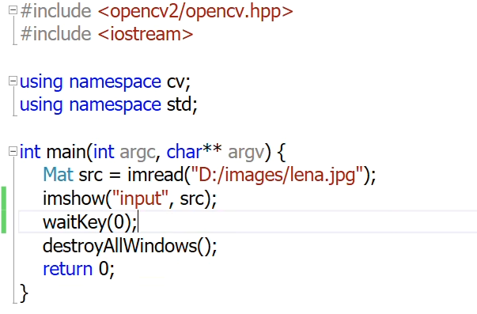
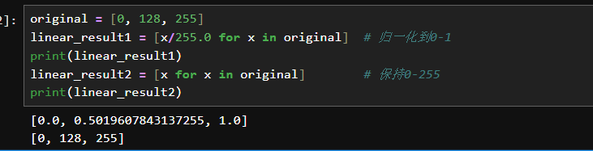

## 图像读取与显示

在opencv中，所有的图像都是Mat(Matrix)，矩阵类型

```c++
Mat cv::imread (const String & 	filename, int flags = IMREAD_COLOR) //图片的读取
//Destroys all of the HighGUI windows.
//The function destroyAllWindows destroys all of the opened HighGUI windows.
void cv::imshow	(const String & winname, InputArray mat )
int cv::waitKey	(	int 	delay = 0	);//延迟函数  当delay为0时代表死循环
void cv::destroyAllWindows	() //资源释放
```



当一张图片过大的时候，电脑的界面可能无法显示完全

我们可以自定义一个窗口，然后将图片放进去显示

```c++
void cv::namedWindow(	const String & 	winname, int flags = WINDOW_AUTOSIZE)
//The function namedWindow creates a window that can be used as a placeholder for images and trackbars. Created windows are referred to by their names.
```

在opencv中，24位表示一个深度  如一个depth() 返回的值为1表示24bit


## 图像色彩空间转换

彩色<->灰色

cvtColor( );

```c++
void cv::cvtColor	(	InputArray 	src, OutputArray 	dst, int 	code, int 	dstCn = 0 )	
    //Converts an image from one color space to another.
    /*
    So the first byte in a standard (24-bit) color image will be an 8-bit Blue component, the second byte will be Green, and the third byte will be Red. The fourth, fifth, and sixth bytes would then be the second pixel (Blue, then Green, then Red), and so on.
    */
```


## 归一化（Normalization）

将数据**缩放到特定范围**的过程。在图像处理中，最常见的归一化是将像素值从原始范围（如0-255）缩放到0-1之间。

- #### **线性变换（Linear Transformation）**

  **定义**：变换T是线性的，当且仅当满足：

  1. 可加性：T(a + b) = T(a) + T(b)
  2. 齐次性：T(k·a) = k·T(a)

  - 图像处理中的线性变换(线性变换不影响相对关系)
    - 缩放：y = kx
    - 对比度调整：y = ax + b
    - 
    - 即在图像中进行线性变换，它在一个元组里面的相对位置不发生改变

- 非线性变换

  - 伽马校正 y = x^γ^

  - 对数变换：y = c * log(1 + x)
  - Sigmoid函数：y = 1/(1 + e^(-x))

在opencv中，对于32bit的图像默认已经做了归一化处理，如果我们直接调用cvtColor函数去将图像进行转化，那么由于伽马矫正是非线性的，就会导致结果错误。

> 1. 只要是浮点图像，先确认范围！
>
>    - 浮点图像判断
>
>      - depth()
>
>        - CV_8U: 8位无符号整数
>        - CV_32F: 32位浮点数
>
>      - type()
>
>        ```c++
>        int type = img.type();
>        int depth = CV_MAT_DEPTH(type);  // 从type中提取深度
>        int channels = CV_MAT_CN(type);  // 从type中提取通道数
>        ```
> 2. 如果输入是8位(0-255)，先除以255
> 3. 如果要做非线性变换，先归一化到0-1
> 4. 查阅API文档，了解函数期望的输入范围
> 5. 调试时总是检查min/max值
>
> **类比：烹饪食谱**
>
> - 线性：所有材料等比例缩放（2人份→4人份）
> - 非线性：烘烤时间（2倍面团≠2倍时间，有指数关系）

imwrite( );

HSV<-> BGR

RGB <-> BGR